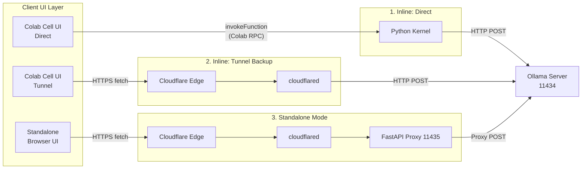
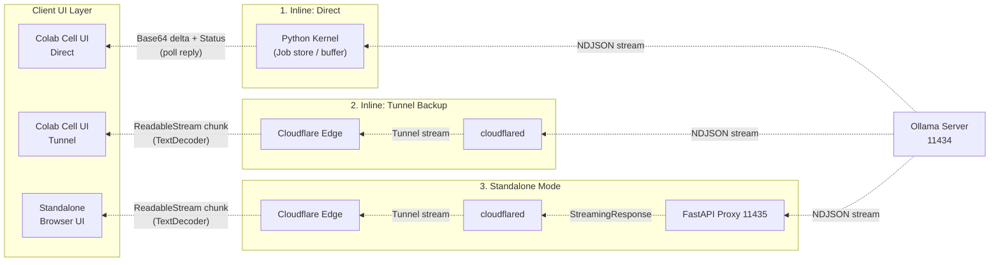

# Ollama Colab Private Chat

[](https://www.python.org/)
[](LICENSE)
[](https://colab.research.google.com/github/hiroaki-com/colab-ollama-server/blob/main/ollama_colab_private_chat_en.ipynb)
[](https://ollama.com/)

[English](./README.EN.md) | [日本語](./README.md)


https://github.com/user-attachments/assets/c4feb357-516b-41da-aa17-8844c5c7b3a8


### Overview

Run Ollama on Google Colab's GPU and chat privately with local LLMs — all within the same notebook. No data sent to external APIs, no logs stored anywhere. Stateless by design: everything is cleared instantly on browser reload.

#### Communication Flow

**Upstream (Request Flow)**



**Downstream (Response Flow)**



| Component | Role |
|:---|:---|
| **Chat UI — Inline** | Renders inside the Colab output cell. Switch between `Direct` (kernel internal) and `Tunnel (Backup)` via tabs |
| **Chat UI — Standalone** | A standalone UI in a separate browser tab. Accessible from other devices via Cloudflare Tunnel |
| **Ollama Server** | Started with `OLLAMA_HOST=0.0.0.0:11434`. Flash Attention and KV cache optimizations enabled |
| **Cloudflare Tunnel** | Issues a public URL with no sign-up or token required. Standalone mode proxies through FastAPI on a dedicated port (11435) |
| **Web Search RAG** | Augments LLM responses with DuckDuckGo search results. Toggle ON/OFF from the chat UI |
| **Model (VRAM)** | Loaded into T4 GPU VRAM. Warmup runs automatically on startup |

#### Key Features

- Completely free · no external API dependency · privacy protected by local inference
- Stateless design — no logs stored anywhere (cleared instantly on browser reload)
- Uses Cloudflare Tunnel — no ngrok account or token required
- Select a model in the UI; pull and warmup run automatically
- Two chat modes: Inline and Standalone
- **Web Search RAG powered by DuckDuckGo** — toggle ON/OFF in the chat UI, with source links displayed alongside responses
- Supports message copy, edit, retry, and Markdown rendering

### Quick Start

#### Notebook

```
https://colab.research.google.com/github/hiroaki-com/colab-ollama-private-chat/blob/main/ollama_colab_private_chat_en.ipynb
```

#### Steps

1. Open the notebook in Google Colab
2. Go to Runtime > Change runtime type > select **T4 GPU**
3. Run the `Model Registry` cell, load the model list, and select a model
4. Run the `Server` cell (first-time model download may take a few minutes)
5. Choose a chat mode and run the corresponding cell
   - `Chat UI — Inline`: chat inside the Colab output cell
   - `Chat UI — Standalone`: chat in a separate browser tab or from another device

### Chat Modes

#### Inline Mode

Runs inside the Colab output cell. Switch the connection method via tabs.

| Mode | Description |
|:---|:---|
| **Direct** (recommended) | Uses Colab kernel internal communication. Fast and stable |
| **Tunnel (Backup)** | Connects via Cloudflare Tunnel. Use as a fallback when Direct is unstable |

#### Standalone Mode

A fully independent UI that opens in a separate browser tab. A FastAPI server and dedicated Cloudflare Tunnel are started automatically — just open the displayed URL to start chatting. Sharing with other devices such as smartphones is also supported.

### Web Search RAG

When the `Server` cell runs, a DuckDuckGo search engine is initialized. Toggle it on or off using the 🔍 Web Search button in the chat UI.

When enabled, the LLM automatically extracts a search keyword from the user's message, fetches results from DuckDuckGo, and uses them as context to generate a grounded response. Source links for the retrieved results are displayed below the AI's reply.

#### Search Parameters

The following parameters can be configured at the top of the `Server` cell.

| Parameter | Description | Default |
|:---|:---|:---:|
| `SEARCH_MAX_RESULTS` | Maximum number of search results to fetch | `5` |
| `SEARCH_BODY_LENGTH` | Maximum character length of body text per result | `300` |
| `SEARCH_TIME_LIMIT` | Time filter for search results (None / Today / 1 Week / 1 Month / 1 Year) | `None` |
| `SEARCH_REGION` | Region/language for search (English (US) / English (UK) / Japanese / Global / etc.) | `English (US)` |

Search results are cached for 5 minutes. If a DuckDuckGo rate limit error occurs, wait a moment before retrying.

### Model Configuration

Specify models as a comma-separated list in the `Model Registry` cell.

```python
model_list = "gemma3:1b, qwen3.5:0.8b, nemotron-3-nano:4b, ministral-3:3b"
num_ctx    = 8192
```

Find available model names at [https://ollama.com/search](https://ollama.com/search).

**Recommended model sizes for T4 GPU**

| Size | Performance | Notes |
|:---:|:---:|:---|
| 1–4B | Fastest | Recommended |
| 8B | Fast | Recommended |
| 14B | Medium | Practical range |
| 20B+ | Slow | Not recommended |

### Tech Stack

- Runtime: Google Colab (Python 3.10+)
- LLM Engine: Ollama
- Tunnel: Cloudflare Tunnel (cloudflared)
- Standalone Server: FastAPI / uvicorn / httpx
- Web Search RAG: DuckDuckGo Search (ddgs) / cachetools
- UI: ipywidgets · marked.js · DOMPurify

### License

MIT License. See [LICENSE](LICENSE) for details.

### Credits

- [Ollama](https://ollama.com/) — local LLM runtime
- [Google Colab](https://colab.research.google.com/) — free GPU environment
- [Cloudflare Tunnel](https://developers.cloudflare.com/cloudflare-one/connections/connect-networks/) — secure tunneling with no sign-up required
- [DuckDuckGo Search](https://pypi.org/project/ddgs/) — privacy-respecting web search engine

### Support

- Bug reports: [Issues](../../issues)
- Questions & discussion: [Discussions](../../discussions)
