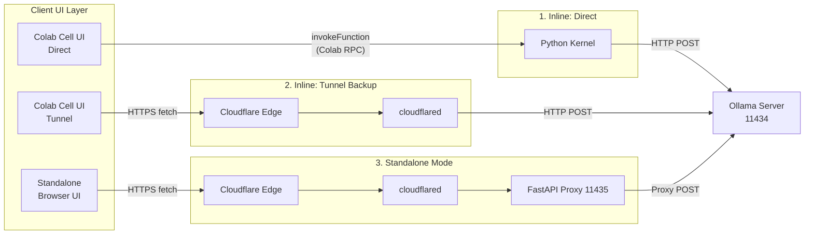
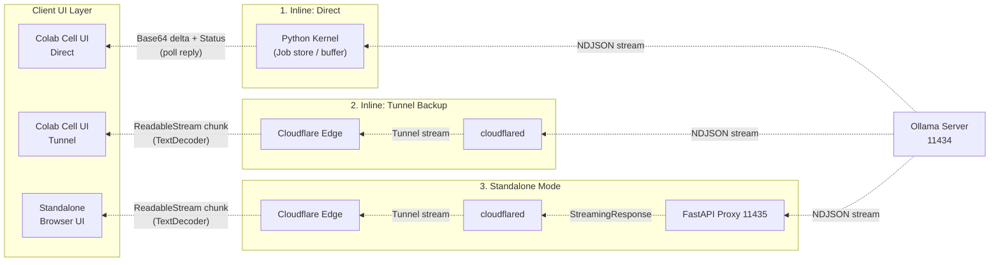

# Ollama Colab Private Chat

[](https://www.python.org/)
[](LICENSE)
[](https://colab.research.google.com/github/hiroaki-com/colab-ollama-server/blob/main/ollama_colab_private_chat_ja.ipynb)
[](https://ollama.com/)

[English](./README.EN.md) | [日本語](./README.md)


https://github.com/user-attachments/assets/c6e13476-5acc-4a16-ba42-b7dae86225f2


### 概要

Google Colab の GPU 上で Ollama を動作させ、同一ノートブック内でローカル LLM とプライベートにチャットできます。外部 API への送信なし、ログ保存なし。ブラウザリロードで即時消去されるステートレス設計です。

#### 通信フロー

**Upstream（リクエストフロー）**



**Downstream（レスポンスフロー）**



| 構成要素 | 役割 |
|:---|:---|
| **Chat UI — Inline** | Colab 出力セル内に描画。`Direct`（カーネル内部通信）と `Tunnel (Backup)` をタブで切替可能 |
| **Chat UI — Standalone** | ブラウザ別タブで動作する独立 UI。Cloudflare Tunnel 経由で他端末からもアクセス可能 |
| **Ollama Server** | `OLLAMA_HOST=0.0.0.0:11434` で起動。Flash Attention・KV キャッシュ最適化済み |
| **Cloudflare Tunnel** | 登録・トークン不要で公開 URL を発行。Standalone モードは専用ポート（11435）で FastAPI をプロキシ |
| **Web Search RAG** | DuckDuckGo 検索結果をコンテキストとして LLM に渡す RAG 機能。UI のトグルで ON/OFF 可能 |
| **Model (VRAM)** | T4 GPU の VRAM にロード。起動時にウォームアップまで自動実行 |

#### 主な特徴

- 完全無料・外部 API 非依存・ローカル推論によるプライバシー保護
- ログを一切保存しないステートレス設計（ブラウザリロードで即時消去）
- Cloudflare Tunnel を使用するため、ngrok アカウント・トークン不要
- モデルを UI で選択し、プルからウォームアップまで自動実行
- Inline と Standalone の 2 つのチャットモードを選択可能
- **DuckDuckGo を使ったWeb検索 RAG 機能**（UI トグルで ON/OFF、検索結果の出典リンクを表示）
- メッセージのコピー・編集・リトライ、Markdown レンダリングをサポート

### クイックスタート

#### 実行環境

```
https://colab.research.google.com/github/hiroaki-com/colab-ollama-private-chat/blob/main/ollama_colab_private_chat_ja.ipynb
```

#### 基本的な実行手順

1. Google Colab でノートブックを開きます
2. Runtime > Change runtime type > **T4 GPU** を選択します
3. `Model Registry` セルでモデルリストを読み込み、起動するモデルを選択します
4. `Server` セルを実行します（初回はモデルのダウンロードに数分かかります）
5. チャットモードを選択して実行します
   - `Chat UI — Inline`：Colab 出力セル内でチャット
   - `Chat UI — Standalone`：ブラウザ別タブ・他端末からチャット

### チャットモード

#### Inline モード

Colab の出力セル内で動作します。通信方式をタブで切替可能です。

| モード | 説明 |
|:---|:---|
| **Direct**（推奨） | Colab カーネル内部通信を使用。高速で安定しています |
| **Tunnel (Backup)** | Cloudflare Tunnel 経由で接続。Direct が不安定な場合のバックアップ |

#### Standalone モード

ブラウザの別タブで動作する独立した UI です。FastAPI サーバーと専用 Cloudflare Tunnel が起動し、表示される URL にアクセスするだけで使用できます。スマートフォンなど他の端末への共有も可能です。

### Web 検索 RAG

https://github.com/user-attachments/assets/cf1d710a-5874-42d7-9c35-97fbb8198ca9

`Server` セルの実行時に DuckDuckGo 検索エンジンが初期化され、Chat UI のトグルボタン（🔍 Web検索）で ON/OFF を切り替えられます。

ON にした状態でメッセージを送信すると、LLM がユーザー入力から検索キーワードを自動抽出し、DuckDuckGo で検索した結果をコンテキストとして付加した上で回答を生成します。AI の応答には参照した出典リンクが表示されます。

#### 検索パラメータ

`Server` セルの冒頭で以下のパラメータを設定できます。

| パラメータ | 説明 | デフォルト |
|:---|:---|:---:|
| `SEARCH_MAX_RESULTS` | 取得する検索結果の最大件数 | `5` |
| `SEARCH_BODY_LENGTH` | 各検索結果から切り出す本文の最大文字数 | `300` |
| `SEARCH_TIME_LIMIT` | 検索対象の期間フィルター（制限なし／当日／1週間／1ヶ月／1年） | `制限なし` |
| `SEARCH_REGION` | 検索対象の地域・言語（日本／全世界／米国 など） | `日本` |

検索結果は 5 分間キャッシュされます。DuckDuckGo のレート制限が発生した場合は、少し時間を置いて再試行してください。

### モデル設定

`Model Registry` セルで、起動するモデルをカンマ区切りで指定します。

```python
model_list = "nemotron-3-nano:4b, ministral-3:3b, qwen3.5:4b"
num_ctx    = 8192
```

モデル名は [https://ollama.com/search](https://ollama.com/search) でご確認いただけます。

**T4 GPU 環境での推奨モデルサイズ**

| サイズ | パフォーマンス | 備考 |
|:---:|:---:|:---|
| 4B | 最速 | 推奨 |
| 8B | 高速 | 推奨 |
| 14B | 中速 | 実用範囲 |
| 20B+ | 低速 | 非推奨 |

### 技術スタック

- Runtime: Google Colab (Python 3.10+)
- LLM Engine: Ollama
- Tunnel: Cloudflare Tunnel (cloudflared)
- Standalone Server: FastAPI / uvicorn / httpx
- Web Search RAG: DuckDuckGo Search (ddgs) / cachetools
- UI: ipywidgets · marked.js · DOMPurify

### ライセンス

MIT License. 詳細は [LICENSE](LICENSE) を参照してください。

### クレジット

- [Ollama](https://ollama.com/) — ローカル LLM 実行エンジン
- [Google Colab](https://colab.research.google.com/) — 無料 GPU 環境
- [Cloudflare Tunnel](https://developers.cloudflare.com/cloudflare-one/connections/connect-networks/) — 登録不要のセキュアトンネリング
- [DuckDuckGo Search](https://pypi.org/project/ddgs/) — プライバシー重視のWeb検索エンジン

### サポート

- バグ報告: [Issues](../../issues)
- 質問・議論: [Discussions](../../discussions)
