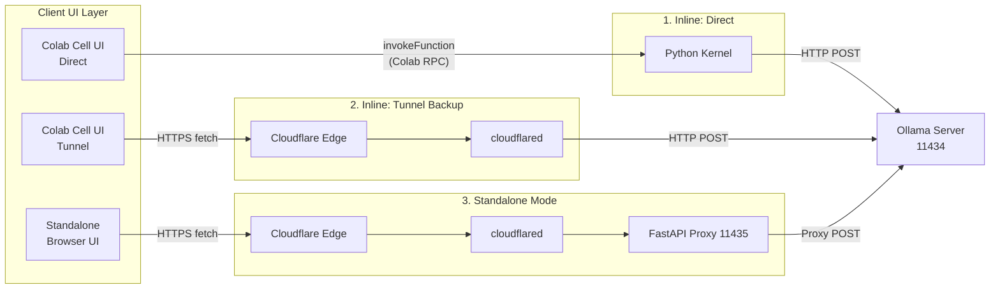
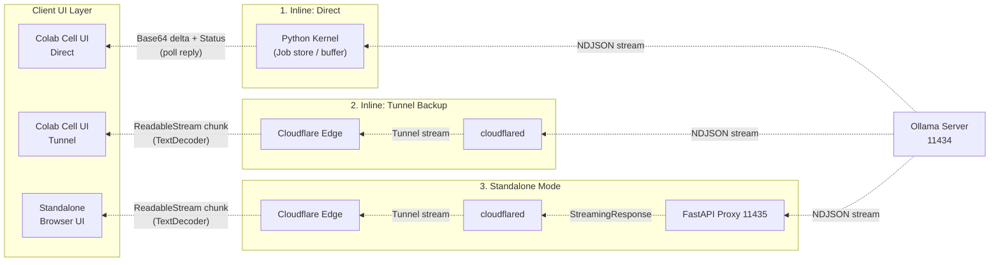

# colab-ollama-private-chat
Provides a stateless chat that connects to an Ollama server running on Google Colab, leaving no conversation history on either the browser or the server.

Upstream (リクエストフロー)

Downstream (レスポンスフロー)

